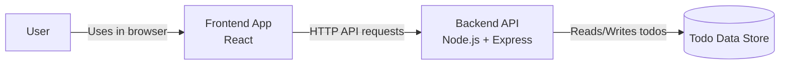
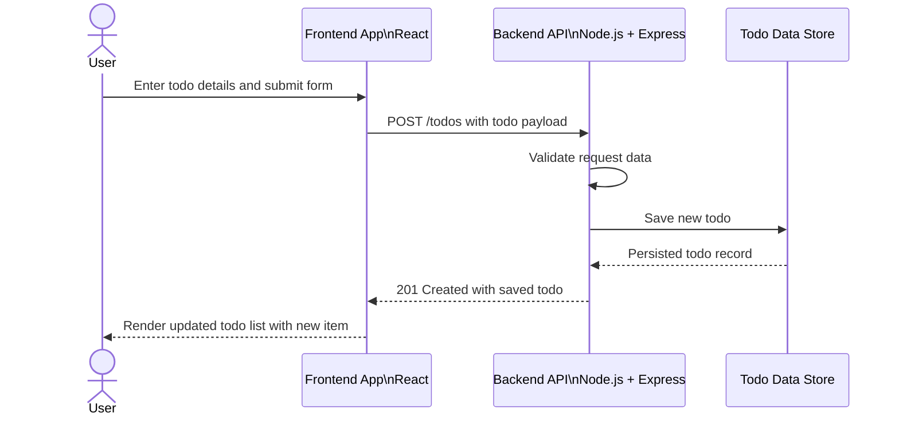

# Cloud Architecture Overview

This repository is a monorepo containing a React frontend and a Node.js backend. The frontend communicates with the backend over HTTP, and the backend manages todo data storage.

## System Context Diagram

## Sequence Diagram: Creating a TODO

## Repository Context

- `packages/frontend`: React frontend application
- `packages/backend`: Node.js backend API
- Root workspace orchestrates both packages for local development and testing
